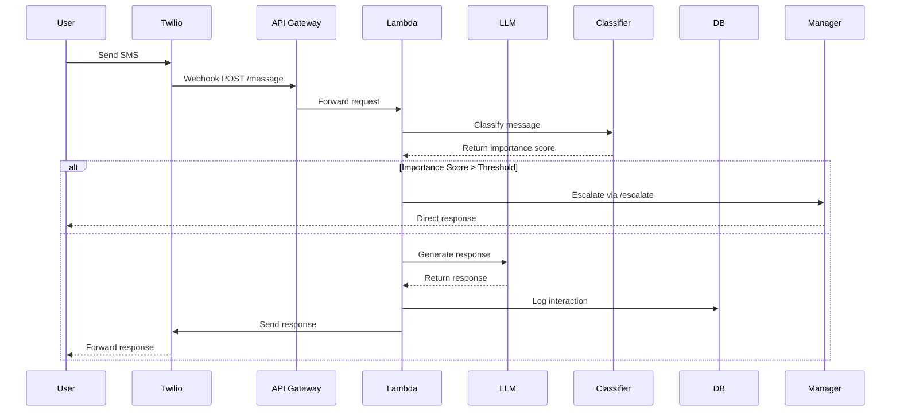

# Message Flow Logic

## Overview
This document outlines the flow of messages through the system, from initial SMS receipt to final response or escalation.

## Sequence Diagram

## Detailed Flow Steps

1. **SMS Reception**
   - User sends SMS to Twilio number
   - Twilio receives message and triggers webhook
   - Webhook sends POST request to `/message` endpoint

2. **API Gateway Processing**
   - Validates Twilio signature
   - Forwards request to Lambda function
   - Handles rate limiting and basic security

3. **Lambda Function Processing**
   - Validates request using `MessageRequest` model
   - Extracts message content and sender info
   - Calls classifier for importance assessment

4. **Message Classification**
   - Classifier processes message text
   - Returns importance score and categories
   - Uses `ClassificationResult` model for response

5. **Decision Point: Escalation Check**
   - If importance_score > threshold:
     - Create `EscalationRequest`
     - Call `/escalate` endpoint
     - Manager receives notification
   - Else:
     - Proceed to LLM response generation

6. **LLM Response Generation**
   - Send message to OpenAI API
   - Generate context-aware response
   - Format response using `MessageResponse` model

7. **Response Delivery**
   - Send response back to Twilio
   - Twilio delivers SMS to user
   - Log interaction in database

8. **Database Logging**
   - Create `MessageLog` entry
   - Store all relevant metadata
   - Track escalation status

## Implementation Notes

### Error Handling
- Implement retry logic for API calls
- Handle Twilio webhook validation failures
- Manage OpenAI API rate limits
- Log all errors with appropriate context

### Security Considerations
- Validate all incoming requests
- Secure API Gateway endpoints
- Protect sensitive data in logs
- Implement proper IAM roles

### Performance Optimization
- Cache common responses
- Optimize Lambda cold starts
- Implement proper connection pooling
- Use async operations where possible

## Next Steps
1. Implement API Gateway configuration
2. Set up Lambda function with FastAPI
3. Configure Twilio webhook
4. Set up database connection
5. Implement classifier integration
6. Add logging and monitoring 